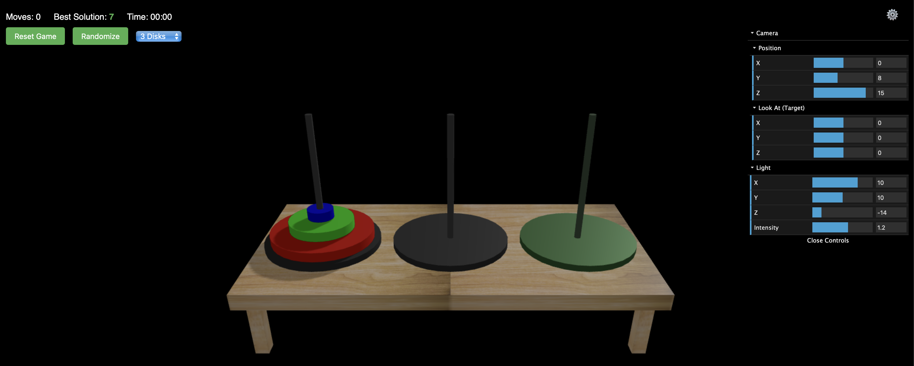

# Towers of Hanoi - 3D Game



This project is a 3D implementation of the classic Towers of Hanoi puzzle game using Three.js. The game provides an interactive experience where users can solve the puzzle by moving disks between rods.

## Features

- Interactive 3D environment with optimized graphics
- Multiple difficulty levels (3-10 disks)
- Mouse/touch and keyboard controls
- Move counter and timer
- Optimal moves calculator
- Smooth animations using GSAP
- Debug panel for development
- Responsive design for all screen sizes
- Real-time move validation
- Victory detection
- Wood-textured table surface
- Destination rod highlighting

## Getting Started

### Prerequisites

- Node.js and npm installed on your machine

### Installation

1. Clone the repository:
   ```bash
   git clone <repository-url>
   ```

2. Navigate to the project directory:
   ```bash
   cd towers-of-hanoi-3d
   ```

3. Install the dependencies:
   ```bash
   npm install
   ```

### Running the Game

To start the development server:

```bash
npm run dev
```

This will use Vite to bundle the application and serve it locally.

### Building for Production

To create a production build:

```bash
npm run build
```

This will create a `dist` directory with the bundled files.

## Dependencies

- **Three.js**: 3D graphics rendering engine
- **GSAP**: Animation library for smooth disk movements
- **Vite**: Build tool and development server

## Game Overview

The game is set up with a 3D scene where:

- **Rods**: Represent the three pegs in the Towers of Hanoi puzzle.
- **Disks**: Can be moved between rods to solve the puzzle.
- **Lighting**: Enhances the visual appearance of the scene.

### Key Functions

- **`init()`**: Initializes the scene, camera, renderer, and game components.
- **`setupRenderer()`**: Configures the renderer.
- **`setupScene()`**: Sets up the scene.
- **`setupCamera()`**: Configures the camera.
- **`setupLighting()`**: Adds lighting to the scene.
- **`createRods()`**: Creates rods in the scene.
- **`createDisks()`**: Creates disks in the scene.
- **`setupEventListeners()`**: Sets up event listeners for user interaction.
- **`moveDiskToRod()`**: Handles disk movement logic and victory conditions.
- **`resetGame()`**: Resets the game state and creates new disks.
- **`startTimer()`**, **`stopTimer()`**, **`updateTimer()`**: Handle game timing functionality.

### Game Features

- Responsive design that adapts to window resizing
- Enhanced visual elements with optimized sizing and spacing
- Improved camera positioning for better gameplay view
- Interactive disk selection and movement using number keys (1-3)
- Move counter and timer to track progress
- Multiple difficulty levels (3-5 disks)
- Victory detection and completion message
- Reset button to start a new game
- Difficulty selector to change number of disks
- Real-time move counter and timer display

## How to Play

- Use number keys 1-3 to select and move disks between rods
- Press the same rod number to deselect a disk
- Selected disks are highlighted in yellow
- Move all disks to the rightmost rod to win
- The game tracks your moves and time
- You can only place smaller disks on top of larger ones

## License

This project is licensed under the MIT License.

## Acknowledgments

Thanks to the creators and maintainers of:
- [Three.js](https://threejs.org/)
- [GSAP](https://greensock.com/gsap/)
- [Vite](https://vitejs.dev/)